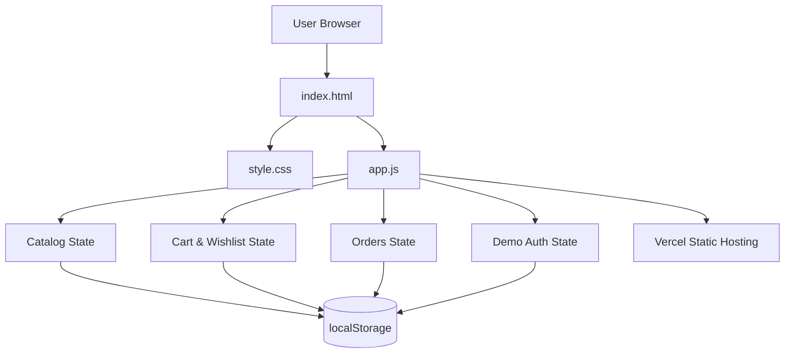

# 🛍️ ShopSphere — Production Capstone

ShopSphere is a production-style e-commerce storefront built as a final web development capstone. It combines authentication simulation, a searchable product catalog, shopping cart, wishlist, order flow, dynamic CRUD product management, and persistent browser state.

## 🚀 Live Deployment

**Vercel:** https://shopsphere-capstone-eight.vercel.app/

## ✨ Features

- 🔐 **Authentication simulation** — login/logout state is persisted with `localStorage`.
- 🛍️ **Interactive catalog** — product cards, category filtering, search, and sorting.
- 🛒 **Shopping cart** — add, remove, and update quantities dynamically.
- ❤️ **Wishlist** — save and remove favorite products.
- 📦 **Order flow** — authenticated users can place orders and view recent orders.
- 🛠️ **CRUD operations** — create, read, update, and delete products from the Admin section.
- 💾 **Persistent state** — products, cart, wishlist, orders, and demo user session survive page refreshes.
- 📱 **Responsive UI** — desktop, tablet, and mobile layouts.
- ⚡ **Vercel-ready** — static frontend with zero server configuration required.

## 🧱 Architecture



### Application flow

```text
User
  ↓
ShopSphere UI
  ↓
JavaScript State Layer
  ├── Authentication simulation
  ├── Product CRUD
  ├── Search / Filter / Sort
  ├── Cart / Wishlist
  └── Order creation
  ↓
Browser localStorage
  ↓
State restored after refresh
```

## 🧰 Tech Stack

- HTML5
- CSS3
- Vanilla JavaScript (ES6+)
- Browser localStorage
- Vercel

## 📁 Project Structure

```text
shopsphere-capstone/
├── index.html
├── style.css
├── app.js
├── vercel.json
└── README.md
```

## 💻 Run Locally

No build tool is required.

1. Download or clone the repository.
2. Open the project folder.
3. Open `index.html` in a browser.

For a local development server, you can also use VS Code Live Server.

## ☁️ Deploy on Vercel

### Option 1 — GitHub import (recommended)

1. Create a new **public GitHub repository** named `shopsphere-capstone`.
2. Upload `index.html`, `style.css`, `app.js`, `vercel.json`, and `README.md`.
3. Commit the files.
4. Sign in to Vercel.
5. Select **Add New → Project**.
6. Import the `shopsphere-capstone` GitHub repository.
7. Framework preset: **Other**.
8. Build command: **leave empty**.
9. Output directory: **leave empty / root**.
10. Click **Deploy**.
11. Copy the generated `.vercel.app` URL into the README and submission form.

### Option 2 — Vercel CLI

```bash
npm i -g vercel
vercel
```

Follow the prompts and choose the project root as the deployment directory.

## 🔐 Demo Authentication

This project intentionally uses simulated authentication for a frontend capstone.

- Enter any valid-looking email.
- Enter a password with at least 4 characters.
- The session is stored locally in the browser.
- No real password or account is sent to a backend.

> For a real production system, authentication should be handled by a secure backend/auth provider and passwords must never be stored in localStorage.

## 🧪 Capstone Feature Checklist

| Requirement | Implementation |
|---|---|
| Authentication simulation | Login/logout modal + localStorage |
| Interactive catalog | Search, category filter, sorting |
| Dynamic CRUD | Admin add/edit/delete products |
| Persistent state | localStorage for app state |
| Cart | Quantity controls + removal |
| Orders | Checkout + recent orders |
| Responsive UI | CSS media queries |
| Cloud deployment | Vercel-ready static deployment |
| Professional documentation | README + architecture diagrams |

## 👩‍💻 Author

**Swati Bhoi**

Final Production Capstone Project — 2026
